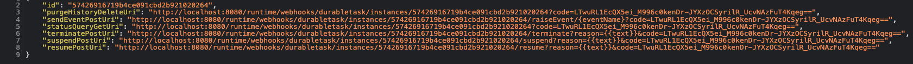
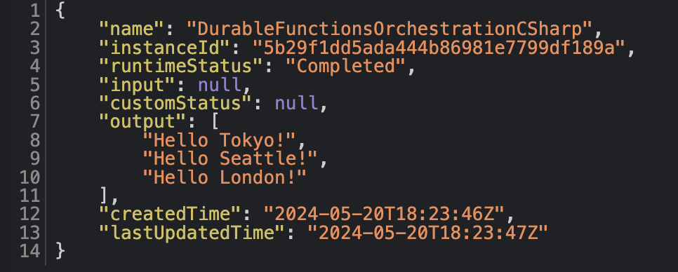

# Create your first C# Durable Functions on Azure Container Apps

[Durable Functions](https://learn.microsoft.com/azure/azure-functions/durable/durable-functions-overview) is an extension of Azure Functions that lets you write stateful functions in a serverless environment. The extension manages state, checkpoints, and restarts for you.

This quickstart will show you how to create a Durable Function that runs on Azure Container Apps.

> Note: Only the [MSSQL storage provider](https://learn.microsoft.com/azure/azure-functions/durable/durable-functions-storage-providers#mssql) is currently supported for running Durable Functions in Azure Container Apps. 

## **Prerequisites**
Before starting, check that you have the right versions specified in this [prequisites table](https://github.com/Azure/azure-functions-on-container-apps#prerequisites). 

## **Create the local C# isolated Functions project**

1\. Run the func init command, as follows, to create a functions project in a folder named *LocalFunctionProj* with the specified runtime:
Below sample built for .NET 7

```sh
func init LocalFunctionProj --worker-runtime dotnet-isolated --docker --target-framework net7.0
```

The \--docker option generates a Dockerfile for the project, which defines a suitable custom container for use with Azure Functions and the selected runtime.

2\. Navigate into the project folder

```sh
cd LocalFunctionProj
```
This folder contains the Dockerfile and other files for the project, including configurations files named [local.settings.json](https://learn.microsoft.com/azure/azure-functions/functions-develop-local#local-settings-file) and [host.json](https://learn.microsoft.com/azure/azure-functions/functions-host-json).
By default, the *local.settings.json* file is excluded from source control in the *.gitignore* file. This exclusion is because the file can contain secrets that are downloaded from Azure.

3\. Open the Dockerfile to include following (Usually found in Line 13)

> FROM mcr.microsoft.com/azure-functions/dotnet-isolated:4-dotnet-isolated7.0

> This version of the base image supports Azure Functions deployment to an Azure Container Apps service check to include below as well in the Dockerfile (found in Line 1)
> FROM mcr.microsoft.com/dotnet/sdk:7.0 AS installer-env 

Sample Dockerfile for .NET 7
```sh
FROM --platform=$BUILDPLATFORM mcr.microsoft.com/dotnet/sdk:7.0 AS installer-env

COPY . /src/dotnet-function-app
WORKDIR /src/dotnet-function-app
RUN dotnet publish *.csproj --output /home/site/wwwroot

# To enable ssh & remote debugging on app service change the base image to the one below
# FROM mcr.microsoft.com/azure-functions/dotnet-isolated:3.0-dotnet-isolated7.0-appservice
FROM mcr.microsoft.com/azure-functions/dotnet-isolated:4-dotnet-isolated7.0
ENV AzureWebJobsScriptRoot=/home/site/wwwroot \
    AzureFunctionsJobHost__Logging__Console__IsEnabled=true

COPY --from=installer-env ["/home/site/wwwroot", "/home/site/wwwroot"]
ENV WEBSITE_HOSTNAME="localhost:80"
ENV AzureWebJobsStorage="<<connection string>>"
ENV SQLDB_Connection="<<connection string>>"
```
> Note : If you are using .NET 7, remember to update the .csproj file <TargetFramework> to point to net7.0 as shown below
  ```sh
    <TargetFramework>net7.0</TargetFramework>
   ```

4\. Create a C# file called *DurableFunctionsOrchestrationCSharp.cs* and add your Durable Functions orchestration to it: 

```c#
using System.Net;
using Microsoft.Azure.Functions.Worker;
using Microsoft.Azure.Functions.Worker.Http;
using Microsoft.Extensions.Logging;

using Microsoft.DurableTask;
using Microsoft.DurableTask.Client;

using System.Threading.Tasks;
using System.Collections.Generic;

namespace Company.Function
{
    public static class DurableFunctionsOrchestrationCSharp
    {
        [Function(nameof(DurableFunctionsOrchestrationCSharp))]
        public static async Task<List<string>> RunOrchestrator(
            [OrchestrationTrigger] TaskOrchestrationContext context)
        {
            ILogger logger = context.CreateReplaySafeLogger(nameof(DurableFunctionsOrchestrationCSharp));
            logger.LogInformation("Saying hello.");
            var outputs = new List<string>();

            // Replace name and input with values relevant for your Durable Functions Activity
            outputs.Add(await context.CallActivityAsync<string>(nameof(SayHello), "Tokyo"));
            outputs.Add(await context.CallActivityAsync<string>(nameof(SayHello), "Seattle"));
            outputs.Add(await context.CallActivityAsync<string>(nameof(SayHello), "London"));

            // returns ["Hello Tokyo!", "Hello Seattle!", "Hello London!"]
            return outputs;
        }

        [Function(nameof(SayHello))]
        public static string SayHello([ActivityTrigger] string name, FunctionContext executionContext)
        {
            ILogger logger = executionContext.GetLogger("SayHello");
            logger.LogInformation("Saying hello to {name}.", name);
            return $"Hello {name}!";
        }

        [Function("DurableFunctionsOrchestrationCSharp_HttpStart")]
        public static async Task<HttpResponseData> HttpStart(
            [HttpTrigger(AuthorizationLevel.Anonymous, "get", "post")] HttpRequestData req,
            [DurableClient] DurableTaskClient client,
            FunctionContext executionContext)
        {
            ILogger logger = executionContext.GetLogger("DurableFunctionsOrchestrationCSharp_HttpStart");

            // Function input comes from the request content.
            string instanceId = await client.ScheduleNewOrchestrationInstanceAsync(
                nameof(DurableFunctionsOrchestrationCSharp));

            logger.LogInformation("Started orchestration with ID = '{instanceId}'.", instanceId);

            // Returns an HTTP 202 response with an instance management payload.
            // See https://learn.microsoft.com/azure/azure-functions/durable/durable-functions-http-api#start-orchestration
            return client.CreateCheckStatusResponse(req, instanceId);
        }
    }
}

```

5\. Install the required extensions using standard NuGet package installation methods, such as [`dotnet add package`](https://learn.microsoft.com/en-us/dotnet/core/tools/dotnet-add-package)
- [Microsoft.Azure.Functions.Worker.Extensions.DurableTask](https://www.nuget.org/packages/Microsoft.Azure.Functions.Worker.Extensions.DurableTask)
- [Microsoft.Azure.Functions.Worker.Extensions.DurableTask.SqlServer](https://www.nuget.org/packages/Microsoft.Azure.Functions.Worker.Extensions.DurableTask.SqlServer)
- [Microsoft.Azure.Functions.Worker.Extensions.Http](https://www.nuget.org/packages/Microsoft.Azure.Functions.Worker.Extensions.Http)

Make sure the package references are in the *.csproj* file: 
```sh
    <PackageReference Include="Microsoft.Azure.Functions.Worker" Version="1.19.0" />
    <PackageReference Include="Microsoft.Azure.Functions.Worker.Extensions.DurableTask" Version="1.1.3" />
    <PackageReference Include="Microsoft.Azure.Functions.Worker.Extensions.DurableTask.SqlServer" Version="1.3.0" />
    <PackageReference Include="Microsoft.Azure.Functions.Worker.Extensions.Http" Version="3.1.0" />
    <PackageReference Include="Microsoft.Azure.Functions.Worker.Sdk" Version="1.15.1" />
```

## Create the required databases 

You'll need a publicly accessible SQL Server instance. Follow [instructions](https://learn.microsoft.com/azure/azure-sql/database/single-database-create-quickstart?view=azuresql&tabs=azure-portal#create-a-single-database) to create an Azure SQL Database. 

You'll also need an Azure Storage account. Use the [az storage account create](https://learn.microsoft.com/en-us/cli/azure/storage/account#az-storage-account-create) command to create a general-purpose storage account:

```sh
az storage account create --name <STORAGE_NAME> --location northeurope --resource-group MyResourceGroup --sku Standard_LRS
  ```
Replace <STORAGE_NAME> with a unique name. Names must contain three to 24 characters numbers and lowercase letters only. Standard_LRS specifies a general-purpose account, which is [supported by Functions](https://learn.microsoft.com/azure/azure-functions/storage-considerations#storage-account-requirements). The --location value is a standard Azure region.

### Update Dockerfile with connection string information
Update the following environment variables:

```
ENV AzureWebJobsStorage="<<connection string>>"
ENV SQLDB_Connection="<<connection string>>"
```

Obtain your Azure SQL database's connection string by navigating to the database's blade in the Azure portal. Then, under **Settings**, select **Connection strings** and obtain the ADO.NET connection string. Make sure to provide your password in the template provided.

Below is an example of the portal view for obtaining the Azure SQL connection string:


Get your Azure Storage account's connection string by nativating to the storage account in the Azure portal. Then, under **Security + networking**, select **Acess keys**. 

### Specify MSSQL as the Durable Functions storage backend in your *host.json*

```json
{
  "version": "2.0",
  "extensions": {
    "durableTask": {
      "storageProvider": {
        "type": "mssql",
        "connectionStringName": "SQLDB_Connection",
        "createDatabaseIfNotExists": true 
      }
    }
  },
  "logging": {
    "logLevel": {
      "DurableTask.SqlServer": "Warning",
      "DurableTask.Core": "Warning"
    }
  }
}  
```

## Build the container image 

> Note: If you have an M1 Mac, follow instructions [here](https://github.com/Azure/azure-functions-core-tools/issues/2901#issuecomment-1597911137) before proceeding. 

The Dockerfile in the project root describes the minimum required environment to run the function app in a container. The complete list of supported base images for Azure Functions is documented above as **Host images** in the pre-requisites section or can be found in the [Azure Functions Base by Microsoft \| Docker
Hub](https://hub.docker.com/_/microsoft-azure-functions-base)


1\. In the root project folder, run the [docker build](https://docs.docker.com/engine/reference/commandline/build/) command, and provide a name and tag.
```sh
docker build --platform linux --tag <DOCKER_ID>/azuredurablefunctionsimage:v1.0.0 .
```

If you have an M1 mac, use `--platform linux/amd64` instead. 

In this example, replace \<DOCKER_ID\> with your Docker Hub account ID. When the command completes, you can run the new container locally.

2\. To test the build, run the image in a local container using the [docker run](https://docs.docker.com/engine/reference/commandline/run/) command, with the adding the ports argument, -p 8080:80.
```sh
docker run -p 8080:80 -it <DOCKER_ID>/azuredurablefunctionsimage:v1.0.0
```

If you have an M1 mac, remember to specify the platform again ` --platform linux/amd64`.

At this point you should see an exception message saying you need to create a firewall rule for your client IP address for access to the SQL database. To do this, go to your database instance on Azure portal and click "Set server firewall" in the _Overview_ page. Then click "Add a firewall rule". You can set the _Start_ and _End IP_ as the IP address in the exception message. Remember to click "Save". 

3\. Now there should be no more errors when running the image. Browse to http://localhost:8080/api/DurableFunctionsOrchestrationCSharp_HttpStart to start your Durable Functions orchestration. You should see different URLs for the particular orchestration instance started: 


Browse to *statusQueryGetUri* to get the status of the orchestration instance and the output:


4\. After you've verified the function app in the container, stop docker with **Ctrl**+**C**.

## Push docker image to Docker Hub

Docker Hub is a container registry that hosts images and provides image and container services. To share your image, which includes deploying to Azure, you must push it to a registry.

> Note: Remember to remove connection strings from your Dockerfile before pushing. 

- Sign in to Docker with the [docker login](https://docs.docker.com/engine/reference/commandline/login/) command, replacing  <docker_id> with your Docker ID. This command prompts you for your username and password. A "Login Succeeded" message confirms that you\'re signed in.
-  Push the image to Docker Hub by using the [docker push](https://docs.docker.com/engine/reference/commandline/push/) command, again replacing <docker_id> with your Docker ID.

```sh
docker push <docker_id>/azuredurablefunctionsimage:v1.0.0
```
- Depending on your network speed, pushing the image the first time might take a few minutes (pushing subsequent changes is much faster). While you\'re waiting, you can proceed to the next section and create Azure resources in another terminal.
 

## Run your Durable Functions app on Azure 

Before you can deploy your container to your Azure Container apps you need to create an Container Apps environment with a Log Analytics workspace and a Azure Functions app. 

1\. Login to your Azure subscription

```sh 
az login
  
az account set -subscription | -s <subscription_name>

az upgrade

az extension add --name containerapp --upgrade

az provider register --namespace Microsoft.Web

az provider register --namespace Microsoft.App

az provider register --namespace Microsoft.OperationalInsights
```
---

2\. Create azure container app environment

Create an environment with an auto-generated Log Analytics workspace.

```sh
  az group create --name MyResourceGroup --location northeurope
  az containerapp env create -n MyContainerappEnvironment -g MyResourceGroup --location northeurope
  ```

4\. Create the function app
 
 Run the [az functionapp create](https://learn.microsoft.com/en-us/cli/azure/functionapp#az-functionapp-create) command to create a new function app in the new managed environment backed by azure container apps.

```sh
az functionapp create --resource-group MyResourceGroup --name <functionapp_name> \
--environment MyContainerappEnvironment \
--storage-account <Storage_name> \
--functions-version 4 \
--runtime dotnet-isolated \
--image <DOCKER_ID>/<image_name>:<version> 
```

In this example, replace **MyContainerappEnvironment** with the Azure container apps environment name. Also, replace <STORAGE_NAME> with the name of the account you used in the previous step, <APP_NAME> with a globally unique name appropriate to you, and <DOCKER_ID> or <login-server> with your Docker Hub ID.

By this point, you should see the following resources created in "MyResourceGroup" on the Azure portal:
 - Storage account
 - SQL database
 - Container app environment 
 - Application Insights 
 - Functions app

5\. Set required app settings

Get you Azure Storage and Azure SQL connection strings from Azure portal. Then go to your function app on portal, expand **Settings**, then click **Configuration**. Add `SQLDB_Connection` app settings and set its value to the SQL connection strings. The `AzureWebJobsStorage` setting should already be there - check that it's set to your storage account's connection string. Click Apply to update the settings. 

6\. Start your Durable Functions orchestration

Because the sample code above uses an HTTP trigger to start the Durable Functions orchestration, you can go to the URL associated with the HTTP trigger to start the orchestration. To do that, find the URL of your app on Azure Portal (look on the top right of the **Essentials** section in the **Overview** tab), it should look something like the following:

```
https://<< your app name >>.northeurope.azurecontainerapps.io
```

Add the following to the end of the URL:

```
/api/{your http trigger name}
```

In the sample code above, the name is `DurableFunctionsOrchestrationCSharp_HttpStart`. 

You should see results similar to what you saw previously when testing locally, but your app is now running on Azure. 

## Clean up resources
If you're not going to continue on to the next sample function app, you can remove the Azure resources created during this quickstart with the following command.

> Note: The following command deletes the specified resource group and all resources contained within it. If the group contains resources outside the scope of this quickstart, they are also deleted.

```
az group delete --name $RESOURCE_GROUP
```